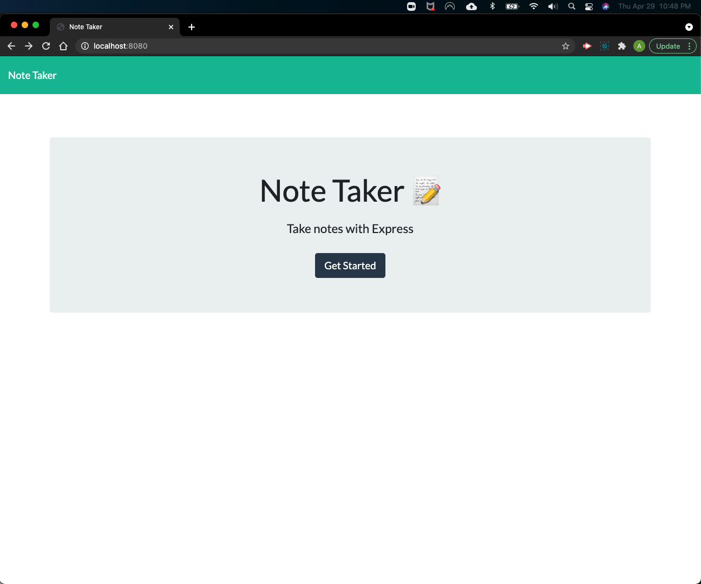
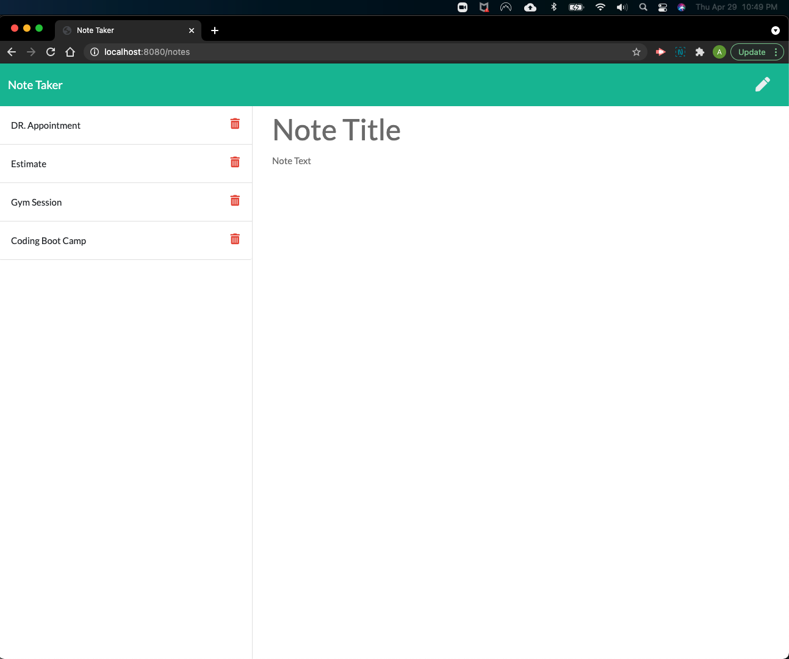

# Note Taker App

## Deployed on Heroku

[Heroku Note Taker](https://whispering-cove-60153.herokuapp.com/)
Click "Heroku Note Taker" for live app. 

## Description
    
    The Note Taker application is able to save and delete notes.
    This application was created using NodeJS, Express andJavaScript.

## Scenario
    - The user can use this application to keep track of notes.
    - The user would simply go to the link where they would be
      presented wit the landing page.
    - The user would simply click on the GET STARTED button.
    - After the button is clicked the user is directed to the 
      notes page.
    - All the user has to do is click on the Note Title and start
      typing.
    - When the user starts typin the save button appears on the 
      right upperhand corner of the window where the user can click
      to save.
    - The user will see all saved notes that are saved to the database.
    - If the user wants to delete a note, all the user has to do is click
      the trash can delete button. 

## License

## Screenshots of Note Taker App Functionality

